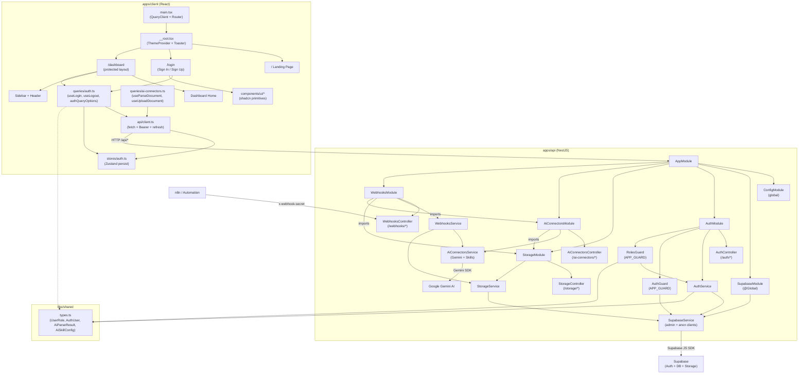

# iCore Starter — Agent Instructions

## Architecture

Nx monorepo with three packages:
- `apps/client` — Vite + React 19 + TanStack Router + React Query + Zustand
- `apps/api` — NestJS 11 (all Supabase interaction goes through here)
- `libs/shared` — shared types and utilities

Frontend does NOT know about Supabase. All data flows through NestJS API.



## Key Patterns

- **Auth**: Supabase Auth via NestJS. Client sends credentials to `/api/auth/login`, gets JWT. Every request includes `Authorization: Bearer <token>`. Global `AuthGuard` + `RolesGuard` on API.
- **Data fetching**: React Query hooks in `apps/client/src/queries/`. API client in `apps/client/src/api/client.ts` with auto token refresh.
- **Global state**: Zustand store in `apps/client/src/stores/auth.ts` (persist middleware, key `starter-auth`).
- **Routing**: TanStack Router file-based routes. `dashboard.tsx` is the protected layout with `beforeLoad` auth check. Landing page at `/` is public.
- **Styling**: Tailwind CSS 4 with `@tailwindcss/vite` plugin. Dark mode by default. shadcn/ui components.
- **File uploads**: Storage module handles upload to Supabase Storage with signed URLs for private buckets.
- **AI connectors**: Gemini-powered document parsing with a skill system. Default "document" skill extracts structured data from any PDF/image. Register custom skills at runtime.
- **Webhooks**: Public endpoints for external automation (n8n). Secured by `x-webhook-secret` header instead of JWT.

## NestJS tsconfig

The API tsconfig overrides `module: CommonJS` and `moduleResolution: node` (required for NestJS decorators). `baseUrl: ../../` resolves `@starter/shared` path.

## Important

- `@Public()` decorator exempts routes from AuthGuard (login, register)
- `@Roles("admin")` restricts to admin users
- Service role client bypasses RLS for all DB operations
- Anon client used only for `signInWithPassword` and `refreshSession`
- Private storage buckets use `storage://` URI scheme. Client resolves via `GET /api/storage/signed-url`.
- `GEMINI_API_KEY` and `GEMINI_MODEL` env vars control AI parsing. Default model: `gemini-2.0-flash`.
- `N8N_WEBHOOK_SECRET` env var secures webhook endpoints.
- Build artifacts (`dist/`, `.vite/`) are gitignored — do not commit them

## Route Structure

- `/` — Public landing page
- `/login` — Auth page (sign in / sign up toggle)
- `/dashboard` — Protected dashboard (requires auth)

## AI Connectors — Skill System

The `AiConnectorsModule` provides a skill-based document parsing system powered by Google Gemini.

### Default skill: "document"

Ships out of the box. Extracts generic structured data (title, date, amount, currency, parties, line items) from any PDF or image.

### API endpoints

- `POST /api/ai-connectors/parse` — parse a file (body: `file` + optional `skill` name). Returns `AiParseResult[]`.
- `POST /api/ai-connectors/upload` — upload file to storage + parse. Returns `{ url, userId, results, count }`.
- `GET /api/ai-connectors/skills` — list registered skills.

### Creating a custom skill

Register a new `AiSkillConfig` in `AiConnectorsService`:

```typescript
// In your feature module's onModuleInit or service constructor:
this.aiConnectors.registerSkill({
  name: "invoice",
  prompt: "You are an invoice parser. Extract products, prices, dates...",
  expectedFields: ["product_name", "price", "date", "store"],
});
```

Then call `POST /api/ai-connectors/parse` with `skill=invoice`.

### Extending for new use cases

1. Define a new `AiSkillConfig` with a domain-specific prompt
2. Register it via `AiConnectorsService.registerSkill()`
3. Optionally create a dedicated controller endpoint that uses the skill
4. Add domain-specific types to `libs/shared/src/types.ts`

## Webhooks

Public endpoints for external automation tools (n8n, Zapier, etc.). Secured by `x-webhook-secret` header.

- `POST /api/webhooks/n8n` — generic action dispatcher (body: `{ action, data }`)
- `POST /api/webhooks/n8n/upload` — file upload + AI parse (body: `file`, `user_id`, optional `skill`)

## Adding New Features

1. Create a new NestJS module in `apps/api/src/<feature>/`
2. Add module, controller, service files
3. Import module in `app.module.ts`
4. Add shared types in `libs/shared/src/`
5. Create React Query hooks in `apps/client/src/queries/<feature>.ts`
6. Add routes under `apps/client/src/routes/dashboard/`
