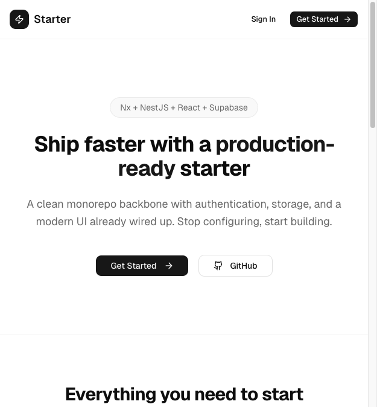

# iCore

Production-ready monorepo starter with NestJS, React, and Supabase.



## What's Included

- **Nx monorepo** with 3 packages (`apps/api`, `apps/client`, `libs/shared`)
- **NestJS 11 API** with Supabase Auth, file storage, AI-powered document parsing, and webhook endpoints
- **React 19 client** with TanStack Router, React Query, Zustand state management, shadcn/ui components, and Tailwind CSS 4
- **Shared types library** consumed by both API and client
- **Full auth flow** -- login, register, token refresh, protected routes, role-based access
- **AI Connectors** -- Gemini-powered document parsing with an extensible skill system
- **Webhooks** -- public endpoints for external automation (n8n, Zapier)

## Tech Stack

**Backend**: NestJS 11, Supabase (Auth + DB + Storage), Google Gemini AI

**Frontend**: React 19, Vite 6, TanStack Router & Query, Zustand, Tailwind CSS 4, shadcn/ui, Lucide icons

**Tooling**: Nx 22, TypeScript 5, npm workspaces

## Quick Start

```bash
# Clone the repo
git clone <your-repo-url> icore
cd icore

# Install dependencies
npm install

# Set up environment variables
cp .env.example .env
cp apps/api/.env.example apps/api/.env
cp apps/client/.env.example apps/client/.env

# Start both API and client in dev mode
npm run dev
```

The client runs at `http://localhost:5173` and the API at `http://localhost:3000`.

## Environment Variables

### API (`apps/api/.env`)

| Variable | Description |
|---|---|
| `SUPABASE_URL` | Supabase project URL |
| `SUPABASE_ANON_KEY` | Supabase anon/public key |
| `SUPABASE_SERVICE_ROLE_KEY` | Supabase service role key (bypasses RLS) |
| `GEMINI_API_KEY` | Google Gemini API key for AI parsing |
| `GEMINI_MODEL` | Gemini model name (default: `gemini-2.0-flash`) |
| `N8N_WEBHOOK_SECRET` | Shared secret for webhook authentication |
| `PORT` | API server port (default: `3000`) |

### Client (`apps/client/.env`)

| Variable | Description |
|---|---|
| `VITE_API_URL` | API base URL (default: `http://localhost:3000/api`) |

## Project Structure

```
icore/
  apps/
    api/                  NestJS backend
      src/
        auth/             Login, register, JWT guards, roles
        supabase/         Global Supabase client (admin + anon)
        storage/          File upload, signed URLs, cleanup
        ai-connectors/    Gemini AI document parsing + skill system
        webhooks/         External automation endpoints
    client/               React frontend
      src/
        api/              HTTP client with auto token refresh
        stores/           Zustand auth store (persisted)
        queries/          React Query hooks (auth, ai-connectors)
        routes/           TanStack Router file-based routes
        components/       UI components (shadcn + layout)
        lib/              Utilities (cn helper)
  libs/
    shared/               Shared TypeScript types
```

## Scripts

| Command | Description |
|---|---|
| `npm run dev` | Start both API and client in watch mode |
| `npm run dev:api` | Start API only |
| `npm run dev:client` | Start client only |
| `npm run build` | Build all packages |

## Routes

| Path | Description |
|---|---|
| `/` | Public landing page |
| `/login` | Sign in / sign up |
| `/dashboard` | Protected dashboard (redirects to `/login` if not authenticated) |

## Documentation

See [docs/GUIDE.md](docs/GUIDE.md) for detailed architecture documentation, API reference, AI skill system guide, and instructions for extending the project.
