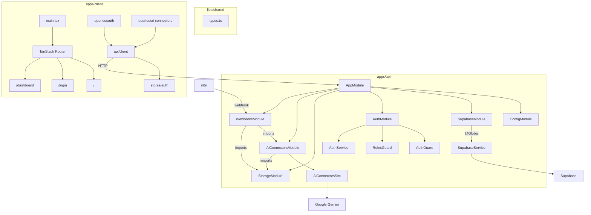

# iCore Architecture Guide

## Overview

iCore is an Nx monorepo with three packages that communicate through a strict layered architecture:

```
Client (React) --HTTP--> API (NestJS) --SDK--> Supabase
                              |
                              +--> Google Gemini AI
```

The frontend never talks to Supabase directly. All data flows through the NestJS API, which uses a service-role client to bypass Row Level Security.

## Architecture Diagram



---

## API Modules

### Auth Module

Handles all authentication and authorization via Supabase Auth.

**Global guards** (applied to every route automatically):
- `AuthGuard` -- extracts Bearer token, verifies via Supabase `getUser()`, attaches user to request
- `RolesGuard` -- checks `@Roles()` metadata against user's role from `user_roles` table

**Decorators**:
- `@Public()` -- exempts a route from AuthGuard
- `@Roles("admin")` -- restricts a route to users with the specified role

**Endpoints**:

| Method | Path | Auth | Description |
|--------|------|------|-------------|
| POST | `/api/auth/login` | Public | Sign in with email + password |
| POST | `/api/auth/register` | Public | Create account + auto-login |
| POST | `/api/auth/refresh` | Public | Refresh expired access token |
| GET | `/api/auth/me` | Bearer | Get current user profile + role |
| POST | `/api/auth/logout` | Bearer | Invalidate session |

### Storage Module

Manages file uploads to Supabase Storage with support for both public and private buckets.

**Endpoints**:

| Method | Path | Auth | Description |
|--------|------|------|-------------|
| POST | `/api/storage/upload` | Bearer | Upload file to a named bucket |
| GET | `/api/storage/signed-url` | Bearer | Get temporary URL for private files |
| DELETE | `/api/storage/remove` | Bearer | Delete a file by URL |

**Private buckets** return a `storage://bucket/path` URI instead of a public URL. The client must call `signed-url` to get a temporary link (valid 1 hour).

### AI Connectors Module

Gemini-powered document parsing with an extensible skill system.

**Endpoints**:

| Method | Path | Auth | Description |
|--------|------|------|-------------|
| POST | `/api/ai-connectors/parse` | Bearer | Parse a file with a named skill |
| POST | `/api/ai-connectors/upload` | Bearer | Upload to storage + parse |
| GET | `/api/ai-connectors/skills` | Bearer | List registered skills |

**Default skill**: `"document"` -- extracts generic structured data (title, date, amount, currency, parties, line items) from any PDF or image.

See the [AI Skill System](#ai-skill-system) section below for details on creating custom skills.

### Webhooks Module

Public endpoints for external automation tools. Secured by `x-webhook-secret` header instead of JWT.

**Endpoints**:

| Method | Path | Auth | Description |
|--------|------|------|-------------|
| POST | `/api/webhooks/n8n` | Secret header | Generic action dispatcher |
| POST | `/api/webhooks/n8n/upload` | Secret header | Upload file + AI parse |

---

## Client Architecture

### Routing

TanStack Router with file-based route generation. The Vite plugin auto-generates `routeTree.gen.ts` from the `routes/` directory.

**Route structure**:
- `/` -- Public landing page (`routes/index.tsx`)
- `/login` -- Auth page with sign-in/sign-up toggle (`routes/login.tsx`)
- `/dashboard` -- Protected layout (`routes/dashboard.tsx`) with nested routes under `routes/dashboard/`

**Auth protection**: The `dashboard.tsx` layout route has a `beforeLoad` guard that checks `useAuthStore.getState().accessToken` and redirects to `/login` if missing.

### Session Management

```
Login form --> POST /api/auth/login --> receive tokens
    |
    v
Zustand store (persisted in localStorage as "starter-auth")
    |
    v
api/client.ts attaches "Authorization: Bearer <token>" to every request
    |
    v
On 401 --> auto-refresh via POST /api/auth/refresh --> retry original request
    |
    v
On second 401 --> logout + redirect to /login
```

### Query Layer

React Query hooks in `src/queries/`:
- `queries/auth.ts` -- `authQueryOptions`, `useLogin()`, `useRegister()`, `useLogout()`
- `queries/ai-connectors.ts` -- `useParseDocument()`, `useUploadDocument()`

All hooks use the `api()` helper from `src/api/client.ts` which handles token attachment, refresh, and error normalization.

### State Management

Single Zustand store with `persist` middleware:
- `stores/auth.ts` -- `accessToken`, `refreshToken`, `user`, `setAuth()`, `setUser()`, `logout()`

---

## AI Skill System

The AI Connectors module uses a skill-based architecture. Each skill is a named configuration with a Gemini prompt and expected output fields.

### How it works

1. Skills are registered in `AiConnectorsService` as `AiSkillConfig` objects
2. When `parse()` is called, the service looks up the skill by name
3. The skill's prompt + the uploaded file are sent to Gemini
4. The response is parsed into `AiParseResult[]` (generic `fields` record + confidence score)

### Creating a custom skill

```typescript
// In your feature module's service:
import { AiConnectorsService } from "../ai-connectors/ai-connectors.service";

@Injectable()
export class InvoiceService implements OnModuleInit {
  constructor(private aiConnectors: AiConnectorsService) {}

  onModuleInit() {
    this.aiConnectors.registerSkill({
      name: "invoice",
      prompt: `You are an invoice parser. Extract all products from this receipt.
Return a JSON array. Each object must have a "fields" key with:
product_name, price, date, store, category, warranty_period.
Use null for missing data. Return ONLY the JSON array.`,
      expectedFields: [
        "product_name",
        "price",
        "date",
        "store",
        "category",
        "warranty_period",
      ],
    });
  }

  async parseInvoice(file: Express.Multer.File) {
    return this.aiConnectors.parse(file, "invoice");
  }
}
```

Then call the API with `skill=invoice`:

```bash
curl -X POST http://localhost:3000/api/ai-connectors/parse \
  -H "Authorization: Bearer <token>" \
  -F "file=@receipt.pdf" \
  -F "skill=invoice"
```

Or from the client:

```typescript
const parse = useParseDocument();
parse.mutate({ file: myFile, skill: "invoice" });
```

### Skill ideas

- **Invoice** -- extract products, prices, dates, store info
- **Contract** -- extract parties, dates, terms, obligations
- **Resume** -- extract name, skills, experience, education
- **Medical report** -- extract diagnoses, medications, dates
- **ID document** -- extract name, ID number, expiry date

---

## Adding New Features

### Adding a new API module

1. Create `apps/api/src/<feature>/` with `<feature>.module.ts`, `<feature>.controller.ts`, `<feature>.service.ts`
2. Import the module in `apps/api/src/app.module.ts`
3. Add shared types to `libs/shared/src/types.ts` and export from `index.ts`

### Adding a client query

1. Create `apps/client/src/queries/<feature>.ts`
2. Use the `api()` helper for HTTP calls
3. Export React Query hooks (`useQuery` / `useMutation`)

### Adding a new route

1. Create a route file under `apps/client/src/routes/dashboard/<name>.tsx`
2. The TanStack Router plugin auto-generates the route tree
3. Add navigation links in `components/sidebar.tsx`

### Adding a new AI skill

1. Define an `AiSkillConfig` with a domain-specific prompt
2. Register it via `AiConnectorsService.registerSkill()` in your module's `onModuleInit`
3. Call `parse(file, "your-skill-name")` from your service or controller

---

## Deployment

### Build

```bash
npm run build
```

This builds both the API (NestJS `nest build`) and the client (Vite `vite build`).

- API output: `apps/api/dist/`
- Client output: `apps/client/dist/`

### Running in production

```bash
# API
cd apps/api
node dist/apps/api/src/main

# Client (serve the static build)
cd apps/client
npx vite preview
```

### Required environment variables

All variables from `apps/api/.env.example` must be set in production. The client only needs `VITE_API_URL` pointing to the deployed API.

### Supabase setup

1. Create a Supabase project
2. Create a `user_roles` table with columns: `user_id` (uuid, FK to auth.users), `role` (text, default "user")
3. Create storage buckets as needed (e.g. `documents` for private files)
4. Copy the project URL, anon key, and service role key to your `.env`
